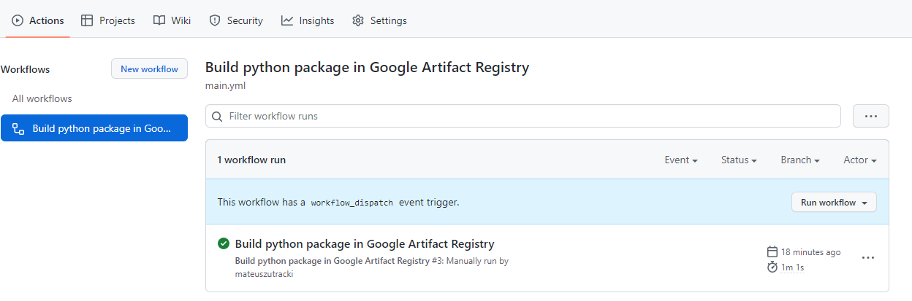

# Algo Components

This repository contains the algo components that Avaus Marketing Innovations AB use in their deliveries. They aim to make writing code faster, easier and more fun.

### Commit customs

#### Size

Commits should be large enough so that they can easily be described as a single, impactful change.

Commits should also be small enough so that you can easily get an overview of what the change is.

#### Formatting

The 50/72 standard introduced by Tim Pope is used for the commit messages:

https://tbaggery.com/2008/04/19/a-note-about-git-commit-messages.html

#### CI CD Artifact Registry

When you merge code to master the CI/CD will try to create new version in artifact registry.
Remember to change version number everytime you want to push something to master.
